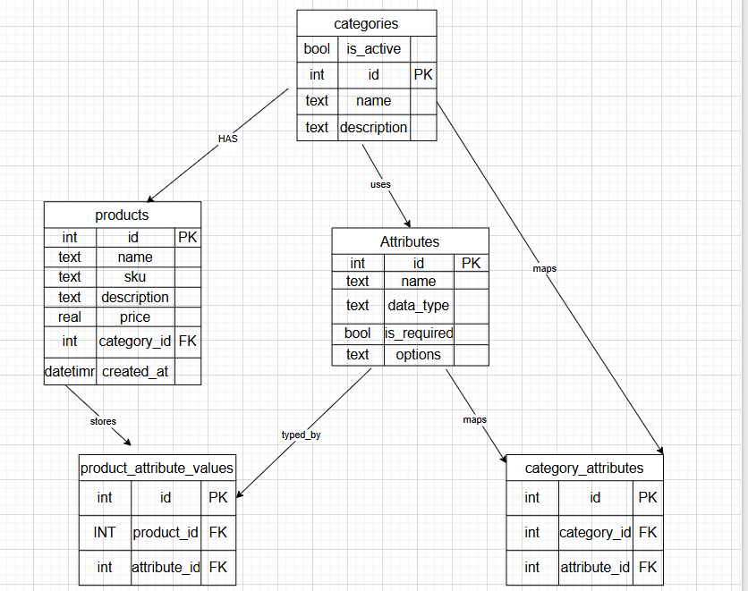
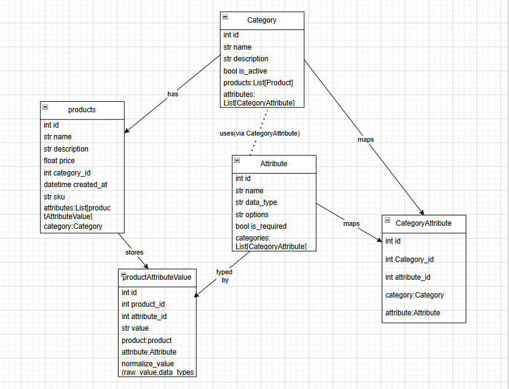

# Ecommerce Catalog Admin Tool (Flask + SQLite)

A minimal internal tool for managing product categories, attributes, and products with category-specific attributes.

---

##  Step 1: Database Design (ERD)

The following ER Diagram illustrates the database schema:



### Key Design Choices
- **Dynamic Categories & Custom Attributes**: The `Attributes` and `ProductAttributeValues` tables support flexible attributes per category without schema changes.
- **Typed Storage**: `ProductAttributeValues` uses typed columns (`text`, `int`, `decimal`, `boolean`, `date`) to support efficient queries per data type.
- **Normalization & Integrity**:
  - Primary and foreign keys enforce relationships.
  - Unique constraints prevent duplicate codes or values.
  - Schema-driven approach helps keep data consistent as the platform scales.

---

##  Step 2: Class Design (UML Class Diagram)

The class diagram below outlines the structure of your Python classes:



### Highlights
- **Category**: Contains logic for managing attributes and products.
- **Attribute**: Stores metadata (`data_type`, `options_json`) and provides validation via `parse_and_validate`.
- **Product**: Associates with multiple `ProductAttributeValue` objects to manage attribute data.
- **ProductAttributeValue**: Encapsulates data type-specific storage and conversion logic.

---

##  Step 3: Implementation & Usage

###  Quick Start (using PowerShell on Windows)
```powershell
python -m venv .venv
.\.venv\Scripts\Activate.ps1
pip install -r requirements.txt

# Initialize database
python - << 'PY'
from app import create_app
from models import db
app = create_app()
with app.app_context():
    db.create_all()
print('Database initialized at catalog.db')
PY

# Launch the Flask app
$env:FLASK_APP = "app.py"
python app.py
